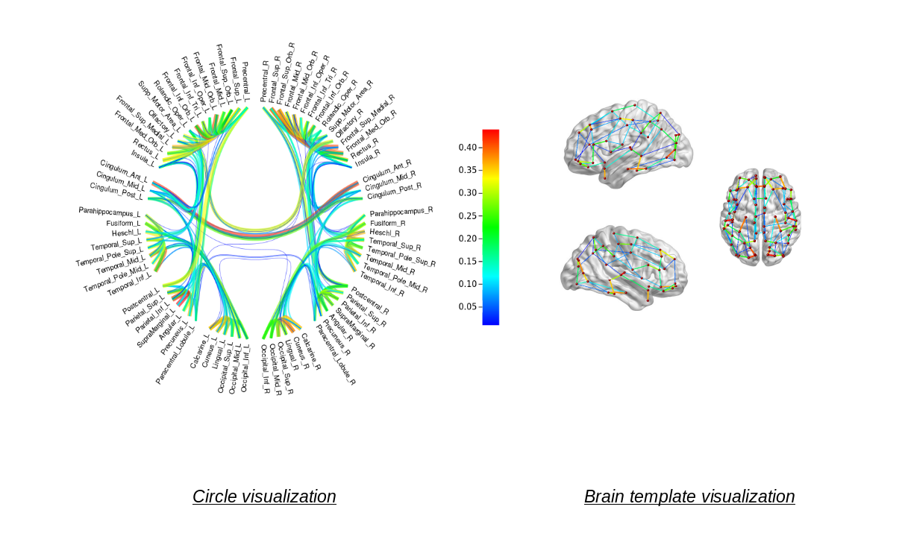

#CIVILITY

Cloud Based Interactive Visualization of Tractography Brain Connectome (CIVILITY) is an interactive visualization tool of brain connectome in the web.

CIVILITY is a web application and has mainly 2 components.

- CIVILITY-visualization ; front end of the application. This is a circle plot of the brain connectivity using the method of visualization : Hierarchical Edge Bundling. The graphic visualization of the brain connectivity is generated using Data Driven Documents (D3.js).

- CIVILITY-tractography ; analysis pipeline. The analysis of the brain connectome is computed by a probabilistic method (FSL tools) using surfaces as seeds.
The main steps of the pipeline are : 
  * bedpostX (FSL): Fitting of the probabilistic diffusion model on corrected data (by default number of tensors = 2 )
  * ExtractLabelSurfaces : creation label surfaces (ASCII files) from a VTK surface containing labels information.(https://github.com/NIRALUser/ExtractLabelSurfaces)
  * Creation of a seeds list : text file listing all path of label surfaces created by ExtractLabelSurfaces tool
  * probtrackx2 (FSL): compute tractography according to the seeds list created.

CIVILITY performs the brain connectivity analysis in remote computing grids where the CIVILITY-tractography pipeline is deployed. CIVILITY uses clusterpost (https://github.com/NIRALUser/clusterpost) to submit the jobs to the computing grid. 

NOTE: clusterpost
clusterpost is a server application providing a REST api to submit jobs in remote computing grids using. Data transfer, job execution and monitoring are all handled by clusterpost.
The front end of CIVILITY submits tasks to clusterpost and retrieves the results when they are finished. 

See documentation in doc/ directory. 

##USAGE for TRACTOGRAPHY 

### 1. Inputs file 

 - DWI image (in diffusion space, nrrd format)
 - T1 image (in diffusion space, nrrd format)
 - Brain mask (in diffusion space, nrrd format)
 - Parcellation table, json file which describes the brain atlas in brain surfaces (format json)
 - Brain Surface. This is a VTK file which represents the white matter surface. This surface must be in the diffusion space. 
		If the white matter surface doesn't contain label information, upload another surface (same mesh, in diffusion space, vtk format) containning labels informations.

### 2. Output connectivity matrix  

(example : 5 seeds )

0  0  713804  0  22  
6  0  12  628238  0 
564497  10  0  47  148119 
0  693669  289  0  8 
27  0  194885  2  0 

##USAGE for VISUALIZATION 

### 1. Inputs file 

#### - Connectivity matrix

(example : 5 seeds )

0  0  713804  0  22  
6  0  12  628238  0 
564497  10  0  47  148119 
0  693669  289  0  8 
27  0  194885  2  0 

#### - Parcellation table 

(example : 5 ROIs, atlas AAL90)

[  
  {  
    "VisuOrder": 78, //This is the rank in the circle plotting   
    "MatrixRow": 1, // Rank in the connectivity matrix - first row = 1 = first column ( if = -1 not in the matrix )    
    "name": "Precentral_L", //Name of the region/seed   
    "VisuHierarchy": "seed.left.frontal.", //Hierachy of the seed (for circle plotting)   
    "coord": [ //Coordinates of the seed   
      -38.649999999999999, //X   
      -5.6799999999999997, //Y  
      50.939999999999998 //Z  
    ],  
    "labelValue": "131 44 78", //Value of the label in the vtk file    
    "AAL_ID": 1  // label/seed ID in the table/atlas   
  },  
  { 
    "VisuOrder": 1,  
    "MatrixRow": 2,  
    "name": "Precentral_R",  
    "VisuHierarchy": "seed.right.frontal.",  
    "coord": [ 
      41.369999999999997,  
      -8.2100000000000009,  
      52.090000000000003 
    ],  
    "labelValue": "241 43 17",  
    "AAL_ID": 2 
  },  
  { 
    "VisuOrder": 77,  
    "MatrixRow": 3,  
    "name": "Frontal_Sup_L",  
    "VisuHierarchy": "seed.left.frontal.",  
    "coord": [ 
      -18.449999999999999,  
      34.810000000000002,  
      42.200000000000003 
    ],  
    "labelValue": "126 31 21",  
    "AAL_ID": 3 
  },  
  { 
    "VisuOrder": 2,  
    "MatrixRow": 4,  
    "name": "Frontal_Sup_R",  
    "VisuHierarchy": "seed.right.frontal.",  
    "coord": [ 
      21.899999999999999,  
      31.120000000000001,  
      43.82 
    ],  
    "labelValue": "70 93 250",  
    "AAL_ID": 4 
  },  
  { 
    "VisuOrder": 76,  
    "MatrixRow": 5,  
    "name": "Frontal_Sup_Orb_L",  
    "VisuHierarchy": "seed.left.frontal.",  
    "coord": [ 
      -16.559999999999999,  
      47.32,  
      -13.31 
    ],  
    "labelValue": "19 164 195",  
    "AAL_ID": 5 
  } 
 ] 

### 2. Output visualization 

